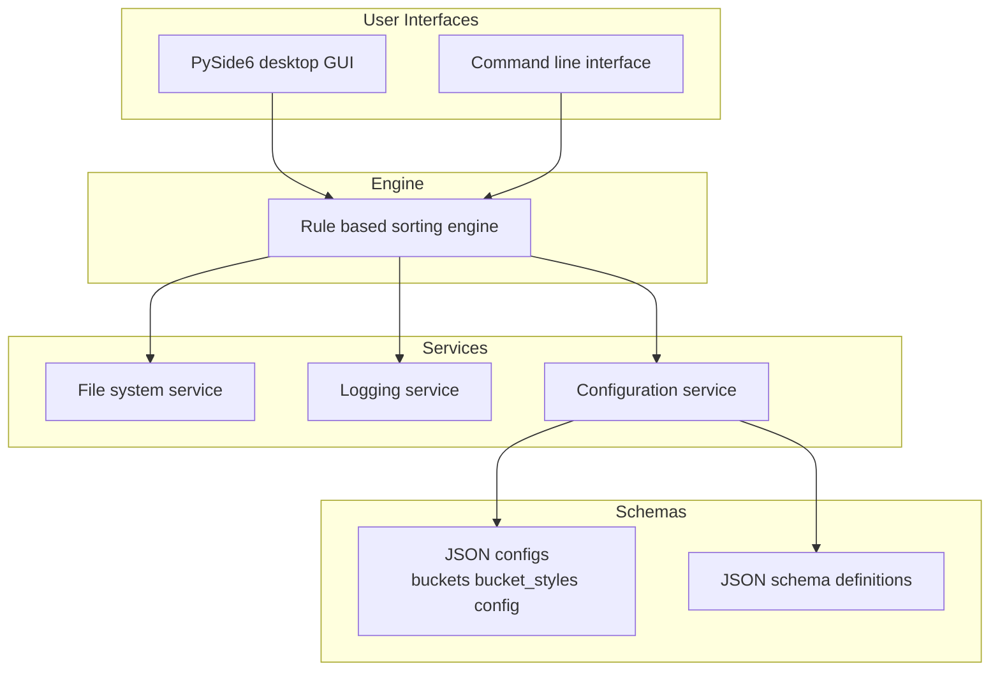

<p align="center">
  
</p>

<p align="center"><strong>Rule-based sample pack and project file organizer for serious music producers.</strong></p>

<p align="center">
  <a href="https://www.python.org/">
    
  </a>
  <a href="https://www.gnu.org/licenses/gpl-3.0.en.html">
    
  </a>
  
</p>

---

> Current Version: 0.x (Active Development)

Producer-OS is a Python desktop application for organizing sample packs and project files with a rule-based engine. It offers both a PySide6 GUI and a command-line interface.

---

## What It Does

Producer-OS organizes music production assets using JSON-defined rules. It reads configuration files and assigns files to defined buckets. Unknown or suspicious files go to UNSORTED or Quarantine locations. All file actions are logged for later inspection.

---

## 🎯 Why Producer OS?

Most file organizers rely mainly on extensions or simple folder patterns. Producer-OS uses rule-based logic, JSON schema validation, and controlled execution modes for every action. It focuses on predictable, explainable, and safe sorting behavior. It is built for producers who want automation without sacrificing control.

---

## Features

- Python desktop application for music producers.
- PySide6-based GUI for interactive control and visualization.
- CLI interface for scripted and headless workflows.
- Rule-based sorting engine for sample packs and project files.
- JSON configuration files: `buckets.json`, `bucket_styles.json`, `config.json`.
- Configuration validation using JSON schemas before performing file operations.
- Safety features including UNSORTED and Quarantine handling for unmatched or unsafe files.
- Detailed logging of all file operations and decisions.
- Support for both GUI and CLI workflows using the same configuration and rules.

---

## 🖼 Interface Preview

(Screenshot or demo GIF coming soon)

---

## Demo


---

## Screenshots


---

## Quick Start

1. Clone the repository:

    ```bash
    git clone https://github.com/KidChadd/Producer-OS.git
    cd Producer-OS
    ```

2. Install dependencies:

    ```bash
    python -m venv .venv
    source .venv/bin/activate  # On Windows: .venv\Scripts\activate
    pip install -r requirements.txt
    ```

3. Run the GUI:

    ```bash
    python -m producer_os
    ```

4. Run the CLI:

    ```bash
    python -m producer_os.cli --help
    ```

---

## Architecture Overview

Producer-OS is structured as a modular Python application. It separates responsibilities across a sorting engine, supporting services, user interfaces, and schemas. The engine evaluates rules from JSON configurations and classifies files. Services handle filesystem access, logging, and interaction with configuration and schema data. The PySide6 GUI and CLI call into the same engine and services, while JSON schemas define and validate configuration structures.



---

## Usage

You can use Producer-OS through the PySide6 GUI or the CLI. Both interfaces rely on the same JSON configuration files and rule-based engine.

To launch the GUI:

```bash
python -m producer_os
```

To use the CLI and see available commands:

```bash
python -m producer_os.cli --help
```

To run a sorting operation from the CLI with an explicit configuration:

```bash
python -m producer_os.cli sort --config path/to/config.json
```

All file moves, copies, and safety-related actions are logged to the output defined by your configuration.

---

## Configuration

Producer-OS uses JSON configuration files to describe buckets, styles, and global behavior. The primary configuration files are:

- `config.json` – global settings, paths, and runtime options.
- `buckets.json` – logical buckets and rules describing which files belong where.
- `bucket_styles.json` – styling and presentation details for buckets in the GUI.

Before any sorting run, Producer-OS validates these JSON files against JSON schemas. If a configuration does not match its schema, the application reports validation errors and does not perform file actions. Safety routing to UNSORTED and Quarantine is controlled by configuration fields within these JSON files.

### Safety Model

Producer-OS enforces several safety guarantees during execution:

- No file deletion by default; operations focus on moving or copying.  
- Files that do not match any rule are sent to an UNSORTED bucket.  
- Files marked or detected as problematic route to a Quarantine location.  
- All actions and decisions are logged for later inspection.  
- JSON schema validation runs before sorting and blocks invalid configurations.

---

## Requirements

- Python 3.x installed on your system.
- A desktop environment capable of running PySide6 (Windows, macOS, or Linux).
- Required Python packages listed in `requirements.txt`.
- Access to the directories that contain your sample packs and project files.

---

## Documentation

Additional documentation is available in the repository:

- `RULES_AND_USAGE.md` – details on rule definitions and typical workflows.
- `TESTING_GUIDE.md` – guidance for running and extending the test suite.
- `SUPPORT.md` – notes on getting help and reporting issues.
- `CONTRIBUTING.md` – contribution guidelines and code expectations.

---

## Roadmap

Planned and ongoing work includes:

- Expanded rule primitives for more detailed file classification.  
- Additional bucket presets for common DAW and sample pack layouts.  
- In-application editors for bucket, style, and configuration files.  
- Enhanced dry-run and diff reporting for planned actions.  
- Richer GUI tooling for browsing logs and reviewing previous runs.

---

## FAQ

**Does Producer-OS delete files?**  
By default, Producer-OS does not delete files. It focuses on moving or copying based on rules.

**Can I customize buckets and styles?**  
Yes. You define buckets in `buckets.json` and visual styles in `bucket_styles.json`.

**Does it support CLI automation?**  
Yes. The CLI interface supports scripted runs, making it suitable for automation workflows.

**Is configuration validated before sorting?**  
Yes. All JSON configuration files are validated against JSON schemas before any file actions run.

**Does the GUI and CLI share the same engine?**  
Yes. Both interfaces use the same rule-based engine, services, and configuration layer.

---

## Contributing

Contributions are welcome. Please fork the repository and create a feature branch from the main branch. Make your changes with clear, descriptive commit messages and keep changes focused. Open a pull request describing your changes and how they relate to Producer-OS behavior.

---

## License

This project is licensed under the GNU General Public License v3.0 (GPL-3.0). See the `LICENSE` file for more information.