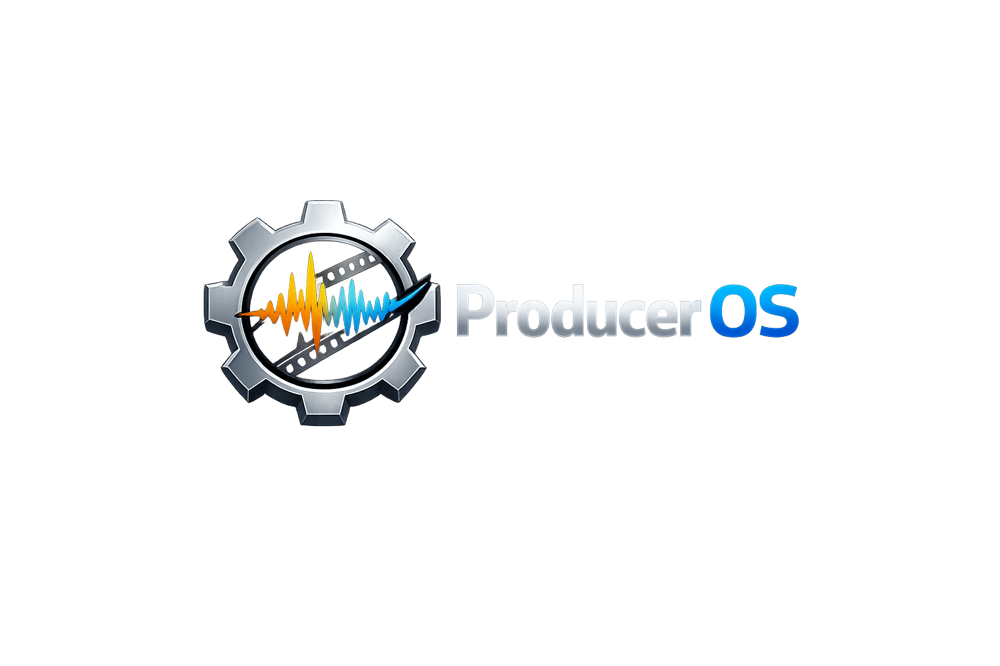
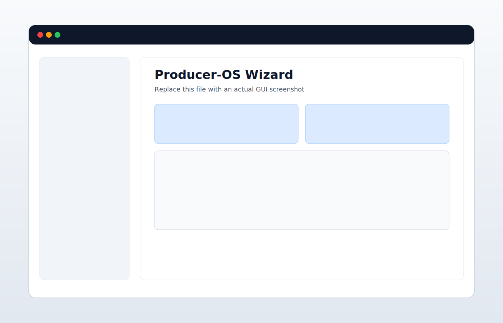
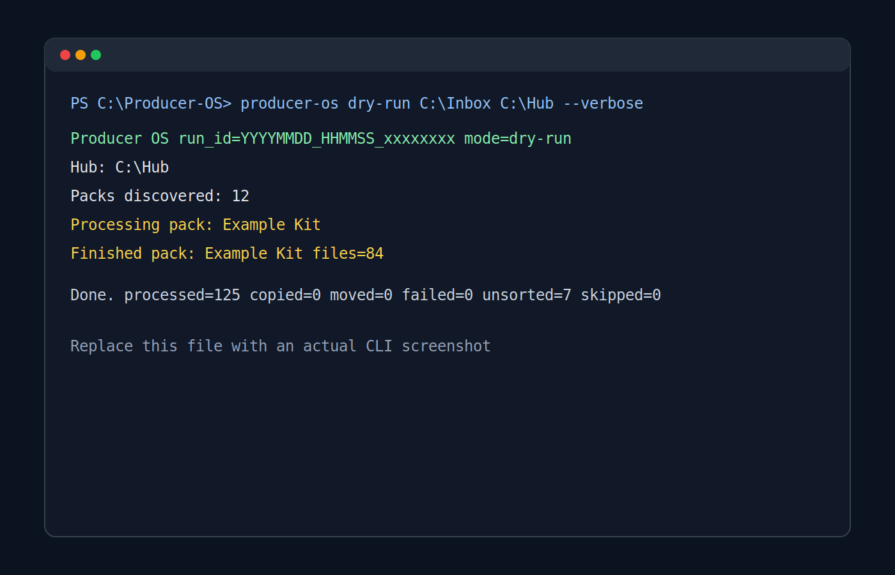

<p align="center">
  
</p>

<h1 align="center">Producer-OS</h1>

<p align="center">
  <strong>Local-first sample-pack organizer for music producers, with a deterministic Python engine, GUI, and CLI.</strong>
</p>

<p align="center">
  <a href="https://www.python.org/">
    
  </a>
  <a href="https://www.gnu.org/licenses/gpl-3.0.en.html">
    
  </a>
  <a href="https://github.com/KidChadd/Producer-OS/actions/workflows/python.yml">
    
  </a>
  <a href="https://github.com/KidChadd/Producer-OS/releases">
    
  </a>
</p>

## Overview

Producer-OS organizes incoming sample packs into a consistent folder structure using a deterministic, rule-based classifier.
It is built for repeatability, explainability, and safety-first operation.

The same engine powers:

- a desktop GUI (PySide6)
- a CLI for batch and scripted workflows

Current v2 classification is focused on `.wav` workflows and combines folder hints, filename hints, audio features, and pitch/glide analysis.

## At a Glance

- Deterministic classification (no ML)
- Local-first processing (no telemetry, no cloud upload of your audio)
- Shared engine across GUI and CLI
- Safer run modes: `analyze`, `dry-run`, `copy`, `move`
- Low-confidence review workflow in the GUI before file operations
- Explainable output in `run_report.json`
- Feature caching (`feature_cache.json`) and audit/undo support

## Privacy

Producer-OS is local-first.

- No telemetry
- No analytics
- No automatic cloud uploads of audio/content

Network access is only needed for things like cloning the repo, downloading releases, or maintainer CI/release automation.

## Support Scope

Primary support target:

- Windows release builds (portable ZIP and installer)
- `.wav` classification workflows
- Windows source installs (CLI/GUI) on Python `3.11+`

Best-effort / experimental:

- non-Windows source installs
- non-`.wav` classification behavior
- local forks that change engine safety or bucket logic

See [`docs/SUPPORT_POLICY.md`](docs/SUPPORT_POLICY.md) and [`docs/COMPATIBILITY_POLICY.md`](docs/COMPATIBILITY_POLICY.md).

## Installation

### Windows Release (Recommended)

Download the latest Windows builds from [GitHub Releases](https://github.com/KidChadd/Producer-OS/releases):

- Portable ZIP (`ProducerOS-<version>-portable-win64.zip`)
- Installer (`ProducerOS-Setup-<version>.exe`)
- `SHA256SUMS.txt` (release checksums)
- `BUILD_INFO.txt` and `BUILD_TIMING.txt` (build provenance and timing)

### Install From Source

GUI + CLI:

```powershell
git clone https://github.com/KidChadd/Producer-OS.git
cd Producer-OS

python -m venv .venv
.\.venv\Scripts\Activate.ps1

python -m pip install --upgrade pip
pip install -e ".[gui]"
```

CLI-only:

```powershell
pip install -e .
```

See [`docs/SYSTEM_REQUIREMENTS.md`](docs/SYSTEM_REQUIREMENTS.md) before setting up a new machine.

## Quick Start

### CLI

```powershell
producer-os --help
producer-os analyze C:\path\to\inbox C:\path\to\hub
producer-os dry-run C:\path\to\inbox C:\path\to\hub --verbose
producer-os copy C:\path\to\inbox C:\path\to\hub
producer-os move C:\path\to\inbox C:\path\to\hub
producer-os benchmark-classifier C:\path\to\inbox C:\path\to\hub
```

### GUI

```powershell
producer-os-gui
```

Recommended first workflow:

1. Run `analyze`.
2. Review the `Low Confidence Review` tab.
3. Save hints/overrides if needed.
4. Rerun before `copy` or `move`.

Module entry points also work:

```powershell
python -m producer_os --help
python -m producer_os gui
```

## Key Features

- Deterministic hybrid WAV classification (no ML)
- Confidence scoring with low-confidence flagging and top-3 candidates
- GUI low-confidence review queue with overrides and hint-save workflow
- Audio preview + waveform in the run review view
- Preview-before-apply workflow before `copy` / `move`
- Batch review actions and row context menu
- Run-page layout persistence (splitter, columns, sort, filters, selected tab)
- Appearance customization (themes, density, accent presets/custom accent)
- Bucket customization (display names, colors, FL Studio `.nfo` icons)
- JSON config + bucket/style mappings with schema validation
- Built-in troubleshooting panel (logs/config/report/dependency checks)
- `benchmark-classifier` command for tuning and distribution/confusion audits
- Portable mode support (`portable.flag` or `--portable`)
- Windows portable ZIP and installer releases

## Outputs and Audit Files

Common generated files you may want to inspect:

- `run_report.json` - per-file reasoning, confidence, and action details
- `feature_cache.json` - cached extracted features for faster reruns
- run logs under your selected output/logging configuration
- undo metadata used by `undo-last-run`

## Screenshots

### GUI



### CLI



## Customization

Producer-OS supports GUI bucket customization:

- bucket display names (`buckets.json`)
- bucket colors (`bucket_styles.json` `Color`)
- FL Studio bucket icons (`bucket_styles.json` `IconIndex` used in `.nfo`)

Use `Options` -> `Bucket Customization`, then rerun `copy`, `move`, or `repair-styles` to apply updated folder styling.

See [`docs/CUSTOMIZATION.md`](docs/CUSTOMIZATION.md) for accepted color/icon formats and validation rules.

The `Options` page also supports appearance customization:

- theme preset (`System`, `Studio Dark`, `Paper Light`, `Midnight Blue`)
- density (`Comfortable`, `Compact`)
- accent mode (`Theme Default`, preset accents, or custom accent color)

## Documentation

### Start Here

- [`docs/README.md`](docs/README.md) - documentation index and detailed CLI mode behavior
- [`docs/SYSTEM_REQUIREMENTS.md`](docs/SYSTEM_REQUIREMENTS.md) - runtime, hardware, and build requirements
- [`docs/CLI_REFERENCE.md`](docs/CLI_REFERENCE.md) - CLI commands and flags
- [`docs/TROUBLESHOOTING.md`](docs/TROUBLESHOOTING.md) - common setup/runtime issues and fixes

### Technical Docs (`docs/`)

- [`docs/CLASSIFICATION.md`](docs/CLASSIFICATION.md) - classifier logic, confidence, reporting, cache
- [`docs/ARCHITECTURE.md`](docs/ARCHITECTURE.md) - engine/UI/services architecture and data flow
- [`docs/CUSTOMIZATION.md`](docs/CUSTOMIZATION.md) - bucket names, colors, and FL Studio `.nfo` icons
- [`docs/RELEASE_PROCESS.md`](docs/RELEASE_PROCESS.md) - versioning and release workflow details
- [`docs/SUPPORT_POLICY.md`](docs/SUPPORT_POLICY.md) - support scope and priorities
- [`docs/COMPATIBILITY_POLICY.md`](docs/COMPATIBILITY_POLICY.md) - compatibility and deprecation policy
- [`docs/GUI_RECREATION_SPEC_LOCK.md`](docs/GUI_RECREATION_SPEC_LOCK.md) - GUI structural baseline/spec-lock tooling

### Project Docs (Root)

- [`CONTRIBUTING.md`](CONTRIBUTING.md)
- [`TESTING_GUIDE.md`](TESTING_GUIDE.md)
- [`ROADMAP.md`](ROADMAP.md)
- [`RULES_AND_USAGE.md`](RULES_AND_USAGE.md)
- [`SUPPORT.md`](SUPPORT.md)
- [`SECURITY.md`](SECURITY.md)
- [`CODE_OF_CONDUCT.md`](CODE_OF_CONDUCT.md)
- [`CHANGELOG.md`](CHANGELOG.md)

## For Contributors

Quick local setup (dev + GUI):

```powershell
python -m venv .venv
.\.venv\Scripts\Activate.ps1
python -m pip install --upgrade pip
pip install -e ".[dev,gui]"
```

Common checks:

```powershell
ruff check src tests
mypy src/producer_os
pytest -q --disable-warnings
```

See [`docs/CONTRIBUTOR_QUICKSTART.md`](docs/CONTRIBUTOR_QUICKSTART.md) and [`TESTING_GUIDE.md`](TESTING_GUIDE.md).

## Community

- Discussions (Q&A / ideas): [github.com/KidChadd/Producer-OS/discussions](https://github.com/KidChadd/Producer-OS/discussions)
- Roadmap and issue ideas: [`ROADMAP.md`](ROADMAP.md)
- Support policy: [`docs/SUPPORT_POLICY.md`](docs/SUPPORT_POLICY.md)
- Compatibility policy: [`docs/COMPATIBILITY_POLICY.md`](docs/COMPATIBILITY_POLICY.md)

## License

Licensed under GPL-3.0-only. See [`LICENSE`](LICENSE).

## Star History

<a href="https://www.star-history.com/#KidChadd/Producer-OS&type=date&legend=top-left">
 <picture>
   <source media="(prefers-color-scheme: dark)" srcset="https://api.star-history.com/svg?repos=KidChadd/Producer-OS&type=date&theme=dark&legend=top-left" />
   <source media="(prefers-color-scheme: light)" srcset="https://api.star-history.com/svg?repos=KidChadd/Producer-OS&type=date&legend=top-left" />
   
 </picture>
</a>
