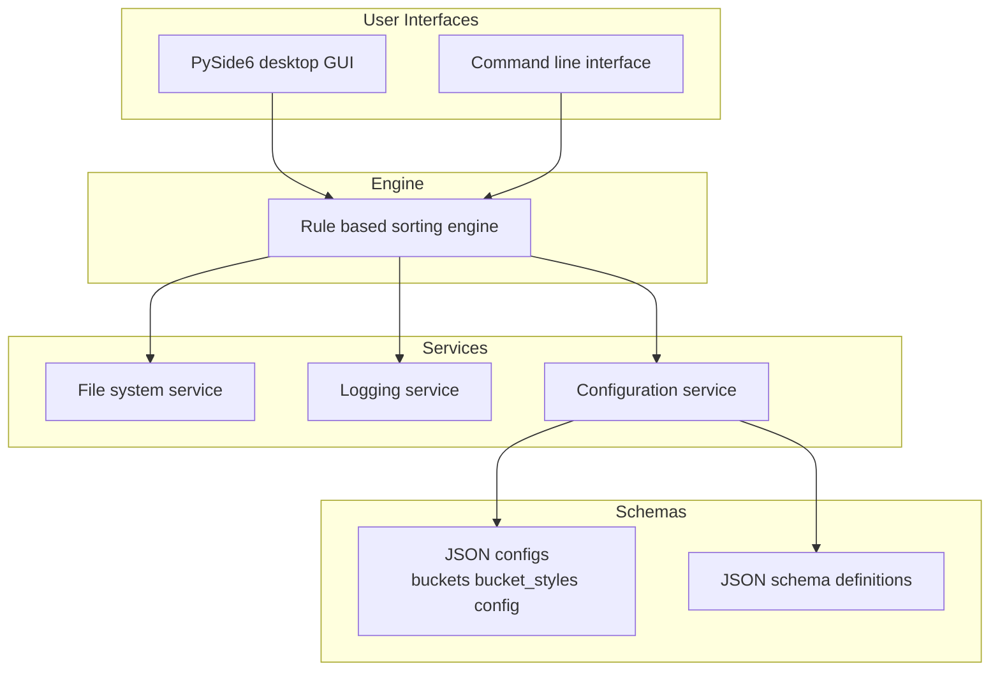

<p align="center">
  
</p>

<h1 align="center">Producer-OS</h1>

<p align="center">
<strong>Rule-based sample pack organizer and music production file manager built with Python.</strong>
</p>

<p align="center">
  <a href="https://www.python.org/">
    
  </a>
  <a href="https://www.gnu.org/licenses/gpl-3.0.en.html">
    
  </a>
  
  
</p>

---

> Current Version: v0.1.1

Producer-OS is a safety-first, rule-driven file organizer for music producers.  
It organizes sample packs, audio files, MIDI packs, presets, and DAW project files using structured JSON rules and schema validation.

Built with Python and PySide6, it provides both:

- A desktop GUI application  
- A command-line interface (CLI) for automation workflows  

---

## What Is Producer-OS?

Producer-OS is a rule-based sample pack organizer designed for serious music production environments.

It helps producers manage:

- Drum kits  
- Sample packs  
- WAV files  
- MIDI packs  
- FL Studio projects  
- Presets and production assets  

Instead of relying only on file extensions or folder names, Producer-OS evaluates files using configurable JSON rules validated by JSON schemas.

Unmatched files are routed to **UNSORTED**.  
Unsafe or flagged files are routed to **Quarantine**.  
Every action is logged and traceable.

---

## Why Producer-OS?

Large sample libraries become unmanageable quickly.

Most file organizers are:

- Extension-based  
- Pattern-based  
- Opaque in their decisions  
- Risky in destructive behavior  

Producer-OS is designed to be:

- Rule-based  
- Schema-validated  
- Non-destructive by default  
- Fully logged  
- Predictable and explainable  

Automation without sacrificing control.

---

## Core Features

- Rule-based sorting engine  
- Shared engine powering both GUI and CLI  
- JSON-driven configuration  
- JSON schema validation before execution  
- PySide6 desktop GUI  
- CLI for scripted and headless workflows  
- Detailed logging of file decisions  
- Automatic UNSORTED and Quarantine routing  
- Modular architecture for extensibility  

---

## Demo


---

## Screenshot


---

## Installation

```powershell
git clone https://github.com/KidChadd/Producer-OS.git
cd Producer-OS

python -m venv .venv
.\.venv\Scripts\Activate.ps1
python -m pip install -e .
```

Run the GUI:

```bash
python -m producer_os
```

Run the CLI:

```bash
python -m producer_os.cli --help
```

---

## Development Setup

```powershell
python -m venv .venv
.\.venv\Scripts\Activate.ps1
python -m pip install -e ".[dev]"
python -m pytest -q
```

---

## Example CLI Usage

```bash
python -m producer_os.cli sort --config path/to/config.json
```

All file operations are validated and logged according to your configuration.

---

## Configuration System

Producer-OS uses structured JSON configuration files:

- `config.json` — global settings and runtime options  
- `buckets.json` — rule definitions and classification logic  
- `bucket_styles.json` — GUI styling metadata  

Before sorting begins, configuration files are validated against JSON schemas.  
Invalid configurations block execution.

---

## Architecture Overview

Producer-OS separates sorting logic, services, interfaces, and schema validation into distinct layers.



---

## Safety Model

Producer-OS enforces:

- No file deletion by default  
- Schema validation before sorting  
- Routing of unmatched files to UNSORTED  
- Routing of unsafe files to Quarantine  
- Full logging of decisions and file actions  

---

## Requirements

- Python 3.11+  
- Desktop environment capable of running PySide6  
- Dependencies managed via `pyproject.toml`  
- Access to your music production directories  

---

## Documentation

- `RULES_AND_USAGE.md`  
- `TESTING_GUIDE.md`  
- `SUPPORT.md`  
- `CONTRIBUTING.md`  

---

## Roadmap

Planned and ongoing improvements:

- Expanded rule primitives  
- Additional bucket presets  
- In-application configuration editors  
- Enhanced dry-run and diff reporting  
- Improved GUI log inspection tools  

---

## FAQ

**Does Producer-OS delete files?**  
No. It moves or copies files according to rules.

**Can I customize buckets and styles?**  
Yes. Buckets and styles are defined in JSON configuration files.

**Does it support CLI automation?**  
Yes. The CLI supports scripted and automated workflows.

**Is configuration validated before sorting?**  
Yes. JSON schema validation runs before any file operations.

**Do GUI and CLI share the same engine?**  
Yes. Both interfaces use the same core engine and configuration layer.

---

## Contributing

Fork the repository and create a feature branch from `main`.  
Keep changes focused and use clear commit messages.  
Open a pull request describing your changes and their impact.

---

## License

GNU General Public License v3.0 (GPL-3.0).  
See `LICENSE` for full details.


## Star History

<a href="https://www.star-history.com/#KidChadd/Producer-OS&type=date&legend=top-left">
 <picture>
   <source media="(prefers-color-scheme: dark)" srcset="https://api.star-history.com/svg?repos=KidChadd/Producer-OS&type=date&theme=dark&legend=top-left" />
   <source media="(prefers-color-scheme: light)" srcset="https://api.star-history.com/svg?repos=KidChadd/Producer-OS&type=date&legend=top-left" />
   
 </picture>
</a>