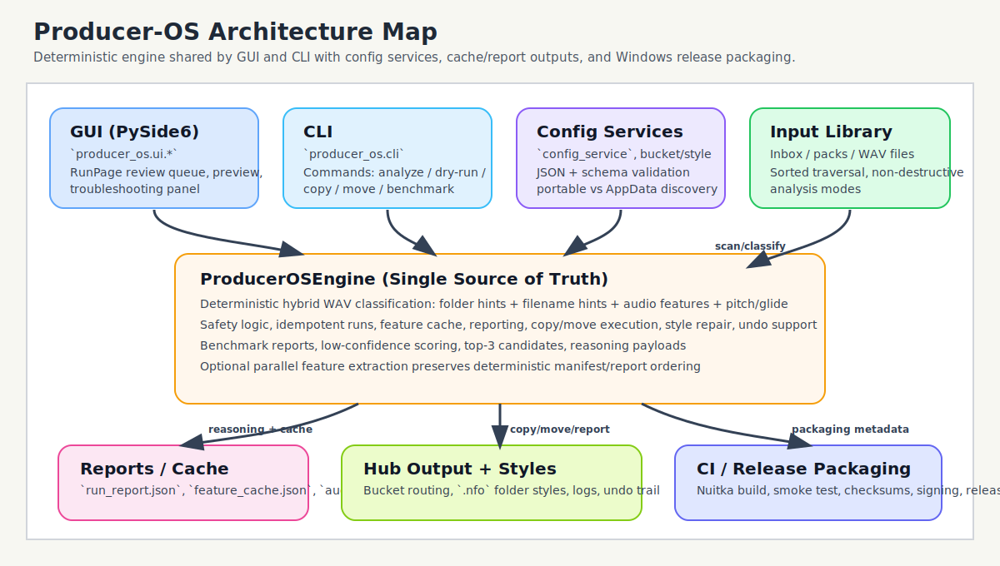

# Architecture

This document describes the high-level architecture of Producer-OS and how the GUI, CLI, engine, and configuration layers interact.

## Overview

Producer-OS uses a shared deterministic engine (`ProducerOSEngine`) for both the desktop GUI and the CLI.

## Architecture Map

Primary layers:

- `producer_os.engine` - core classification, routing, reporting, cache, and safety logic
- `producer_os.ui.*` - PySide6 GUI pages, window shell, background engine runner
- `producer_os.cli` - command-line parsing and engine orchestration
- `producer_os.config_service` - config discovery (AppData vs portable), JSON load/save, schema validation
- `producer_os.styles_service` - FL Studio `.nfo` folder style generation
- `producer_os.bucket_service` - bucket display-name mapping (`buckets.json`)

## Data Flow

### GUI Flow

1. `producer_os.ui.app.main()` creates `QApplication` and `ProducerOSWindow`
2. `ProducerOSWindow` loads config, styles, and bucket mappings via `ConfigService`
3. User selects inbox/hub/options and triggers `Analyze` or `Run`
4. `ProducerOSWindow.start_engine_run()` creates `ProducerOSEngine` and starts `EngineRunner`
5. `EngineRunner` runs the engine in a background thread and emits `(report, report_path)`
6. `RunPage` displays:
   - summary stats
   - pack breakdown
   - low-confidence review queue
   - reasoning/details per file
7. `OptionsPage` also exposes bucket customization (display names, colors, `.nfo` `IconIndex`) and troubleshooting tools
8. User can export the report (with optional GUI-side `manual_review` overlay)

### CLI Flow

1. `producer_os.cli` parses subcommands and arguments
2. `ConfigService` loads config/styles/bucket mappings (and bucket hints)
3. `ProducerOSEngine` runs one of the modes (`analyze`, `dry-run`, `copy`, `move`, etc.)
4. CLI prints JSON output (or benchmark summary + JSON path for `benchmark-classifier`)

## Engine Responsibilities

`ProducerOSEngine` is the single source of truth for routing/classification behavior.

Responsibilities:

- recursive pack discovery
- `.wav`-only classification
- deterministic hybrid scoring:
  - folder hints
  - filename hints
  - audio features
  - pitch + glide detection
- low-confidence detection + top-3 candidate scoring
- feature caching (`feature_cache.json`)
- report generation (`run_report.json`)
- copy/move execution and audit logging (`audit.csv`)
- style repair (`repair_styles`)
- undo support (`undo_last_run`)

## Determinism + Safety Boundaries

### Determinism

- no ML / no randomness in classification
- sorted pack discovery and sorted file traversal
- optional parallel extraction preserves manifest order in reports
- golden regression tests lock representative classification outcomes

### Safety

- `.wav` files only are analyzed/routed
- no audio file mutation
- no per-file `.nfo`
- `analyze` is strict no-write (no logs, no cache save, no `.nfo`)
- `dry-run` writes reports/logs only (no transfer, no `.nfo`)

## Reports and Caches

### `run_report.json` (log-writing modes)

Location:

- `HUB/logs/<run_id>/run_report.json`

Includes:

- run summary counters
- per-pack file entries
- per-file reasoning (`folder_matches`, `filename_matches`, `audio_summary`, `pitch_summary`, `glide_summary`)
- low-confidence flag + top-3 candidates
- `feature_cache_stats`

### `feature_cache.json`

Location:

- `HUB/feature_cache.json`

Key format:

- `{absolute_path}|{size}|{mtime}`

Cache is reused across runs and reported via `feature_cache_stats`.

## Config and Rule Files

Config location depends on mode:

- standard mode: platform config dir (Windows: `%APPDATA%\ProducerOS`)
- portable mode: app directory (`portable.flag`)

Files:

- `config.json` - user settings
- `bucket_styles.json` - FL Studio folder styling
- `bucket_styles.json` stores bucket/category `Color`, `IconIndex`, and `SortGroup`
- `buckets.json` - bucket display names
- `bucket_hints.json` - additive filename/folder keyword hints for classifier tuning

## Release/Packaging Notes

- Windows builds use Nuitka standalone packaging
- CI verifies Qt `qwindows.dll` is bundled
- CI runs a packaged GUI smoke test (`PRODUCER_OS_SMOKE_TEST=1`)
- release workflow supports optional `signtool`-based code signing placeholders

See:

- `docs/RELEASE_PROCESS.md`
- `docs/TROUBLESHOOTING.md`
- `docs/CUSTOMIZATION.md`
